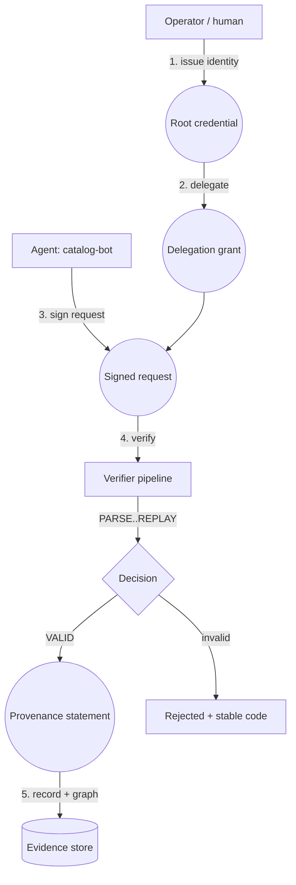

# TESSERRA — Project Context

> Handoff context for anyone (developer, agent, or reviewer) picking up this repository.
> Last updated: 2026-09-02.

## 1. What this is

**TESSERRA** is a local-first reference implementation for **verifiable agent identity,
delegation, and signed requests**. It proves *who* an agent is and *what authority* it was
granted, using signed, content-addressed evidence — without trusting a magic "authenticated"
flag.

The on-wire protocol and package namespace are deliberately **neutral** and are **not** named
after the product:

- Protocol: `agent-proof/v1`
- Identifiers: `urn:agent-proof:*`, `agid:v1:*`
- npm workspace scope: `@agent-proof/*`
- CLI command: `agentctl`

**TESSERRA is the replaceable display name** (config lives in `config/product.json`). Renaming
the product must never require changes to signed wire values or protocol code.

### What it is NOT

- Not a hosted IAM / OAuth / OIDC replacement.
- Not SPIFFE/SPIRE, MCP, or A2A (those are integration boundaries only).
- Not a general agent framework or policy engine.
- Not yet a published npm distribution or a production multi-tenant SaaS.

## 2. Repository layout (pnpm monorepo)

```
packages/
  protocol/        wire objects, canonicalization, validation, RFC 8785 + I-JSON
  core/            deterministic verifier pipeline + identity/delegation/request creation
  crypto-local/    scrypt + AES-256-GCM encrypted local keys (Ed25519)
  storage-sqlite/  SQLite persistence (public JWKs only; never private keys)
  service/         application services + ports (identity/delegation/request verification)
  api-contract/    typed HTTP models, routes, OpenAPI
  api-client/      typed API client
  api-server/      loopback-only HTTP server (127.0.0.1)
  host-local/      concrete local composition root (SQLite + filesystem keys)
  sdk/             public SDK surface
  cli/             `agentctl`
  adapter-mcp/     MCP proof-carrier boundary (experimental)
  adapter-spiffe/  SPIFFE IdentityProvider/TrustProvider boundary
  adapter-a2a/     A2A extension/sender-receiver boundary
apps/
  landing/         public marketing site (static Vite)
  docs/            separate documentation site (static Vite)
  dashboard/       local operations dashboard (Vite + typed API client)
docs/              RFCs, threat model, standards, ADRs, guides, security
tests/conformance/ frozen positive/negative verification vectors
```

## 3. Branches

| Branch | Purpose | Status |
|---|---|---|
| `vorflux/tesserra-product` | **Current.** TESSERRA rename + logo. | HEAD, tested (lint/build/typecheck/test pass) |
| `main` (`origin/main`) | Previous direct-push line (still shows "ATTEST"). | Behind the rename |
| `vorflux/docs-and-visual-redesign` | Docs site + landing/dashboard redesign. | Merged into history |
| `vorflux/attest-product` | Earlier implementation line (old name). | Superseded |
| `vorflux/attest-rfc-plan` | Milestone-1 plan branch. | Superseded |

## 4. Build, test, run

Node 24 (see `.node-version`), pnpm only (the catalog + `workspace:*` require pnpm — **npm/Yarn
cannot install this workspace**).

```bash
corepack enable
corepack pnpm install --frozen-lockfile

corepack pnpm lint          # prettier + eslint + package boundaries + doc examples
corepack pnpm build         # all packages + apps
corepack pnpm typecheck     # strict tsc across the workspace
corepack pnpm test          # unit/integration/conformance/property tests
corepack pnpm test:clean-clone  # clean-clone install/build/test gate
corepack pnpm dev:docs      # serve the docs site
```

CLI:

```bash
corepack pnpm --filter @agent-proof/cli exec agentctl -- --help
```

## 5. Authentication / login flow

**Today (local):** the API binds to `127.0.0.1` and trusts only loopback peers. It is an
operational tool on the developer's own machine, **not** a hosted login system. The only
protected mutation is trust reload, guarded by a constant-time `x-local-reload-token`.

**For a hosted dashboard (planned):**

```
Browser → Supabase Auth (Google/GitHub OAuth) → JWT session
        → GitHub/Vercel-hosted dashboard (first login required)
        → protected backend API (validates JWT + audience + tenant)
        → tenant-scoped TESSERRA evidence (SQLite/Postgres per tenant)
```

- OAuth = user/operator login. It is **separate** from agent identity.
- Agent signing keys live behind a secret manager/KMS, never in browser env vars.
- Supabase can provide Auth (OAuth) + Postgres for users/tenants; it does **not** replace the
  agent-signing-key / protocol layer.

## 6. Dummy agent end-to-end flow

A concrete walkthrough using a fictional agent `catalog-bot`:

1. **Issue identity** — an operator creates a root credential for `agid:v1:acme/catalog-bot`.
   The credential is signed by a configured issuer authority and pins the agent's public key.
2. **Delegate authority** — the root grants a narrower delegation (e.g. only `inventory.read`
   on resource `urn:acme:warehouse/eu-1`) to the agent, with limits on time, depth, audience.
3. **Sign a request** — `catalog-bot` signs a request bound to `action=inventory.read`,
   a task id, audience, resource, and payload digest.
4. **Verify** — the verifier runs one ordered pipeline:
   `PARSE → VERSION → CRYPTO → TIME → TRUST → CHAIN → STATUS → BINDING → REPLAY`.
5. **Record provenance** — a provenance statement links authority refs, the request, and the
   produced digest so the full chain reconstructs later.



## 7. Deployment

- **Landing / docs / dashboard:** Vercel static projects (root-aware monorepo commands).
- **Dashboard:** needs the backend API at `VITE_API_BASE_URL`; without it, it shows truthful
  offline/unavailable states.
- **Backend:** a separate host (Railway/Render/Fly/AWS) with persistent storage, secret
  manager/KMS for signing keys, TLS ingress, and monitoring. The loopback API is **not** exposed
  to the public internet.

## 8. Status

Implemented (local): identity, delegation, signed requests, deterministic verification, local SDK/
CLI/API, SQLite persistence, MCP/SPIFFE/A2A boundaries, landing + docs + dashboard.

In progress / remaining: online replay consumption (partially wired), status-authority-backed
revocation, atomic key rotation, remote provenance graph/export API, deployment hardening.

See `docs/guides/roadmap.md` for phase-by-phase detail.
